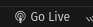
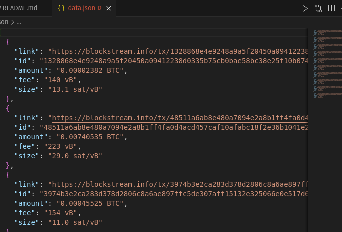

#### Installing typescript:
```bash
npm install -g typescript
```

#### Installing typescript:
```bash
npm init -y
```

#### Installing dependencies:
```bash
npm install
```

#### TypeScript initialization:
```bash
tsc --init
```

#### Generating js files in dist/ folder:
```bash
tsc
```
#### Running backend server-process:
```bash
node dist/server.js
```

#### Live server setup:

* Install extension Live Server


* Run Live Server:



### Resault:
    if all good data should be in data.json

